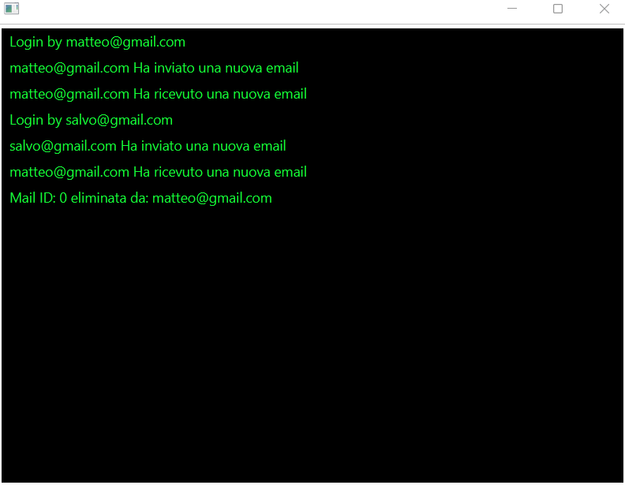
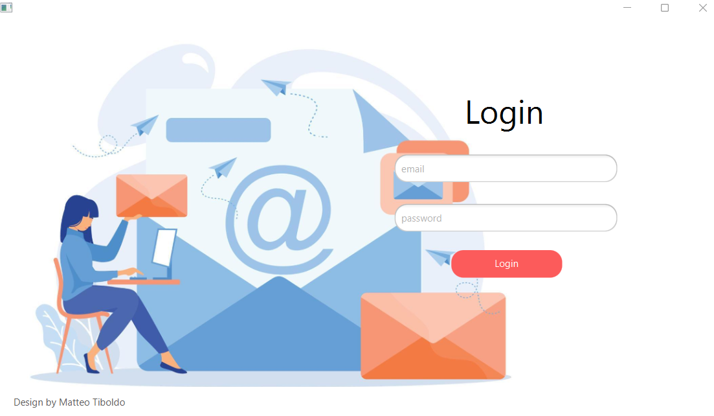
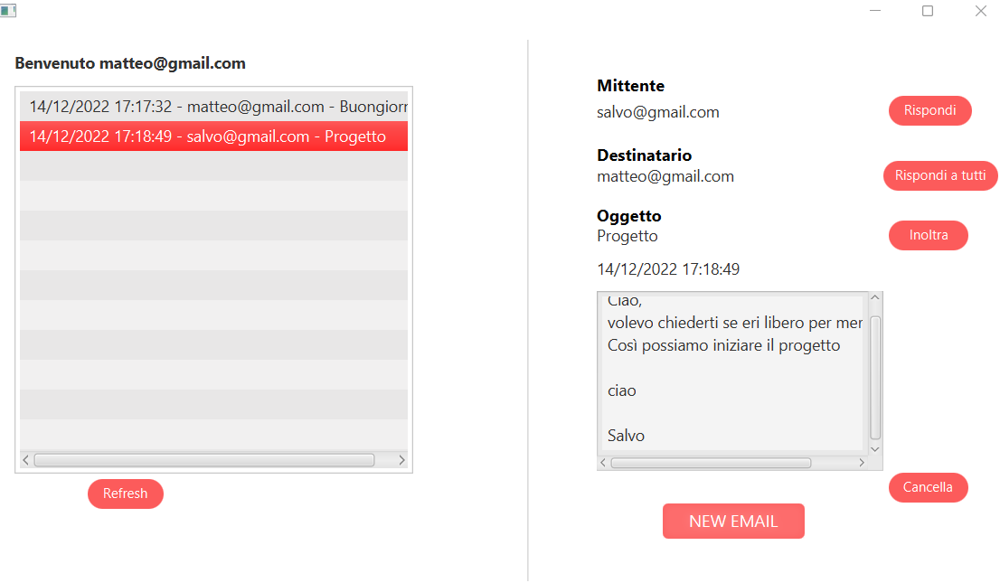
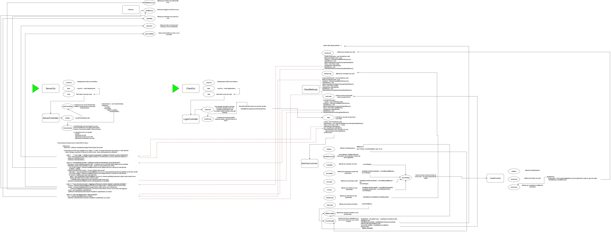

**Autori**
Matteo Tiboldo

**Getting Started**
Ricordarsi di attivare: "allow multiple istance"
Avviare come prima cosa il ServerGUI e successivamente il ClientGUI (posso aprirne anche più di uno)

**Presentazione progetto**
Il progetto consiste nello sviluppo di un servizio di posta elettronica contenente:
    - Un mail Server che mediante l'utilizzo dei thread gestisce le caselle di posta elettronica degli utenti
    - I mail Client che collegandosi al server permettono agli utenti l'accesso alle proprie caselle 
      di posta elettronica

L'applicazione si avvia inizialmente avviando il **ServerGUI** che avvierà il Server

Successivamente si avvia il **ClientGUI** che avvierà inizialmente la schermata di Login dell'user

Dopo aver effettuato il Login l'utente avrà disponibili le proprie mail e potrà inviare, rispondere, inoltrare una mail 
ad una altro utente.

**Consegna**
Si sviluppi un’applicazione Java che implementi un servizio di posta elettronica organizzato con un mail server che 
gestisce le caselle di posta elettronica degli utenti e i mail client necessari per permettere agli utenti di accedere 
alle proprie caselle di posta.
    • Il mail server gestisce una lista di caselle di posta elettronica e ne mantiene la persistenza utilizzando file 
    (txt o binari, a vostra scelta, non si possono usare database) per memorizzare i messaggi in modo permanente.
    • Il mail server ha un’interfaccia grafica sulla quale viene visualizzato il log delle azioni effettuate dai mail 
    clients e degli eventi che occorrono durante l’interazione tra i client e il server.
    Per esempio: apertura/chiusura di una connessione tra mail client e server, invio di messaggi da parte di un client, 
    ricezione di messaggi da parte di un client, errori nella consegna di messaggi.
    NB: NON fare log di eventi locali al client come per esempio il fatto che ha schiacciato un bottone, aperto una 
    finestra o simili in quanto non sono di pertinenza del server.

• Una casella di posta elettronica contiene:
    ○ Nome dell’account di mail associato alla casella postale (es.giorgio@mia.mail.com).
    ○ Lista (eventualmente vuota) di messaggi. I messaggi di posta elettronica sono istanze di una classe Email che 
    specifica ID, mittente, destinatario/i, argomento, testo e data di spedizione del messaggio.
• Il mail client, associato a un particolare account di posta elettronica, 
ha un’interfaccia grafica così caratterizzata:

○ L’interfaccia permette di:
- creare e inviare un messaggio a uno o più destinatari (destinatari multipli di un solo messaggio di posta elettronica)
- leggere i messaggi della casella di posta
- rispondere a un messaggio ricevuto, in Reply (al mittente del messaggio) e/o in Reply-all (al mittente e a tutti i destinatari del messaggio ricevuto)
- girare (forward) un messaggio a uno o più account di posta elettronica
- rimuovere un messaggio dalla casella di posta.
- 
○ L’interfaccia mostra sempre la lista aggiornata dei messaggi in casella e, quando arriva un nuovo messaggio, notifica 
l’utente attraverso una finestra di dialogo.
○ NB: per semplicità si associno i mail client agli utenti a priori: non si richiede che il mail client offra le 
funzionalità di registrazione di un account di posta. Inoltre, un mail client è associato a una sola casella di 
posta elettronica e la sua interfaccia non richiede autenticazione da parte dell’utente.

• NB: il mail client non deve andare in crash se il mail server viene spento 
– gestire i problemi di connessione al mail server inviando opportuni messaggi di errore all’utente e fare in modo 
che il mail client si riconnetta automaticamente al server quando questo è novamente attivo.

**Requisiti tecnici**
• Per la dimostrazione si assuma di avere 3 utenti di posta elettronica che comunicano tra loro. Si progetti però il 
sistema in modo da renderlo scalabile a molti utenti.
• L’applicazione deve essere sviluppata in Java (JavaFXML) e basata su architettura MVC, con Controller + viste e Model,
seguendo i principi del pattern Observer Observable. Si noti che non deve esserci comunicazione diretta tra viste e 
model: ogni tipo di comunicazione tra questi due livelli deve essere mediato dal controller o supportata dal pattern 
Observer Observable. Non si usino le classi deprecate Observer.java e Observable.java. Si usino le classi di JavaFX 
che supportano il pattern Observer Observable.
• L’applicazione deve permettere all’utente di correggere eventuali input errati (per es., in caso di inserimento di 
indirizzi di posta elettronica non esistenti, il server deve inviare messaggio di errore al client che ha inviato il 
messaggio; inoltre, in caso di inserimento di indirizzi sintatticamente errati il client stesso deve segnalare il 
problema senza tentare di inviare i messaggi al server).
• I client e il server dell’applicazione devono parallelizzare le attività che non necessitano di esecuzione 
sequenziale e gestire gli eventuali problemi di accesso a risorse in mutua esclusione. NB: i client e il server di 
mail devono essere applicazioni java distinte; la creazione/gestione dei messaggi deve avvenire in parallelo alla 
ricezione di altri messaggi.
• L’applicazione deve essere distribuita (i mail client e il server devono stare tutti su JVM distinte) attraverso 
l’uso di Socket Java.

**Requisiti dell’interfaccia utente**
L’interfaccia utente deve essere:
• Comprensibile (trasparenza). In particolare, a fronte di errori, deve segnalare il problema all’utente.
• Ragionevolmente efficiente per permettere all’utente di eseguire le operazioni con un numero minimo di click e di 
inserimenti di dati.
• Deve essere implementata utilizzando JavaFXML e, se necessario, Thread java. Non è richiesto, ma consigliato, l’uso 
di Java Beans, properties e binding di properties.
Note: - Si raccomanda di prestare molta attenzione alla progettazione dell’applicazione per facilitare il parallelismo 
nell’esecuzione delle istruzioni e la distribuzione su JVM diverse. - Si ricorda che: - Il progetto SW può essere 
svolto in gruppo (max 3 persone) o individualmente. Se lo si svolge in gruppo la discussione deve essere fatta 
dall’intero gruppo in soluzione unica. - La discussione potrà essere fatta nelle date di appello orale 
dell’insegnamento, che saranno distribuite su tutto l’Anno Accademico. - Si può discutere il progetto SW prima o dopo 
aver sostenuto la prova orale. - Come da regolamento d’esame il voto finale si ottiene come media del voto della 
prova orale e della discussione di laboratorio (i due voti hanno ugual peso nella media). - Il voto finale deve 
essere registrato entro fine settembre 2022, data oltre la quale non è possibile mantenere i voti parziali. 
Leggere il regolamento d’esame sulla pagina web delll’insegnamento per ulteriori dettagli.

##### **Spiegazione Progetto**

Il progetto consiste:

    nello sviluppo di un servizio di posta elettronica organizzato con:
      - un mail server che gestisce le caselle di posta elettronica degli utenti
      - i mail client necessari per permettere agli utenti di accedere alle proprie caselle di posta elettronica

L'applicazione si avvia inizialmente nella **ServerGUI**, dove avviene lo Start del server e lo start della scena
(e successivamente la sua visualizzazione) -> il metodo launch() contenuto nel main avvia l'applicazione

Viene avviato così il **ServerController** che permette la creazione di un ServerSocket
(la prima volta nel metodo initialize -> che chiama il socketThreadStart)

    Esso mediante l'utilizzo di un loop infinito si prepara ad accettare le connessioni di più client con s.accept()
    (punto in cui si blocca fino quando un client non prova ad eseguire una connessione)

Ogni volta che si connette un client la connessione viene accettata e il programma prosegue andando a creare un Thread
La sincronizzazione dei thread vengono gestiti con **Platform.runLater(()->{})** e il lock ReentrantReadWriteLock:

      Platform.runLater(()->{}): che viene usato se voglio che qualcosa venga eseguito nel thread principale
        Quando un thread aggiorna la UI tale update deve essere eseguito nel main thread ed è per questo che per le 
        applicazioni di JavaFX viene usatto, appunto perchè l'applicazione è il main Thread

        - RunLater è come se fosse un sistema di coda, quindi metterà il thread in coda e lo eseguirà non appena il main
          thread sarà libero

All'interno di questo metodo troviamo la chiamata al ThreadHandler a cui passiamo il socket e lo username (all'inizio null)
Esso è l'implementazione del main thread di una applicazione; è utilizzato per fare degli aggiornamenti all'interfaccia in
risposta ai messaggi inviati dagli altri thread che sono attivi durante l'avvio dell'applicazione

      Se il socket non è chiuso eseguo un metodo while(true) che legge ciclicamente l'input stream del socket -> passato dai client
      
      Leggo l'inputStream del socket ed in base all'istruzione passata (come coppia) la eseguo e scrivo il risultato nell'outStream
      (1-Login,2-Richiesta di mail,3-invio di una mail,4-eliminazione di una mail)
Per eseguire queste richieste devo fare l'accesso ai dati tramite il metodo **FileQuery**

     Esso interroga i file json per salvare ed eliminare le mail
      Utilizza il ReentrantReadWriteLock per l'accesso in mutua esclusione dei file

Un **CLIENT** si avvia dalla ClientGUI dove viene avviata l'applicazione e quindi il LoginController con la relativa scene -> login.fxml

    Il LoginController in base ai dati inseriti nei TextField ->controlla che la mail rispetti un determinato pattern e poi invia i dati
    al ClientMethods

    Il ClientMethods esegue il metodo del login e apre la connessione al socket (socket = new Socket(host, port)) e prende l'outputStream 
    del socket  e scrive in tale stream la coppia Pair(1,mail+pwd) che verrà letta dal ServerController che legge l'input stream e che in 
    base all'id dell'operazione svolge un metodo -> in questo caso quello del login
    Successivamente il ClientMethods.login legge l'input stream e in base a cosa ha scritto il ServerController (che ha scritto a sua volta
    nell'outputStream) verifica se l'utente ha eseguito correttamente l'accesso
    In caso di login negativo viene visualizzato l'errore e viene chiuso il socket

In caso di login positivo allora viene fatto lo switch di vista al mailView e viene chiuso l'inputStream,l'outputStream e il socket
(quindi il socket viene aperto e chiuso per ogni operazione effettuata dal client)

Il mailListController:
handleMouseClick -> visualizzo tutti i dettagli dell'email selezionata e visualizzo i bottoni per azioni aggiuntive
In base al pulsante che premo genero un evento diverso:

        - CreateNewMail -> secondStage
        - AnswerMail -> secondStage + destinatario
        - answerAll -> secondStage + destinatari
        - forwardMail -> secondStage + oggetto + testo
        - deleteMail -> mailList.remove
        - refreschAllMails -> checkNewMails

SecondStage:

    Creo la nuova scena newmail.fxml con i parametri passati (se ci sono)

Initialize:

    setto tutti i bottoni e i dettagli delle mail invisibili
    fillMailList -> inserisco i parametri dentro la maillist
    creo un thread con un timer che chiama checkNewMail() ogni 10 sec

**Mappa Concettuale**

